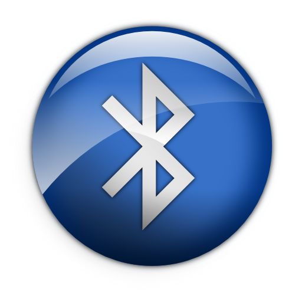
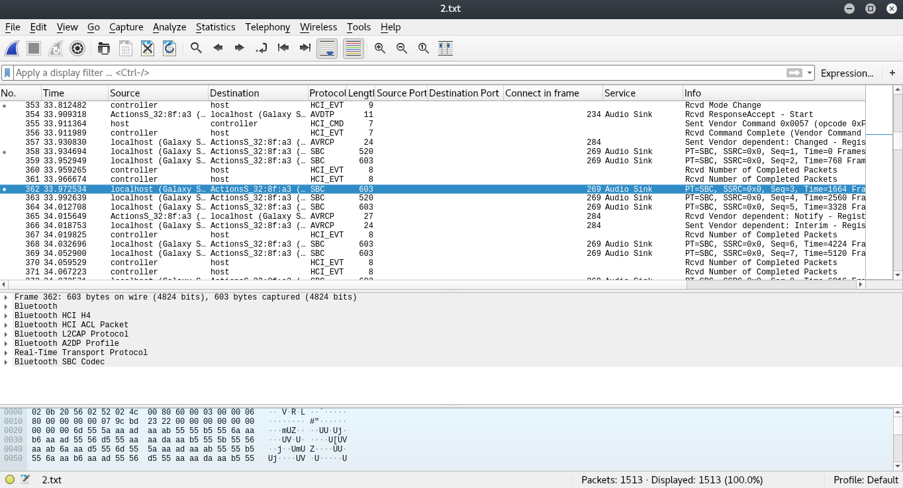
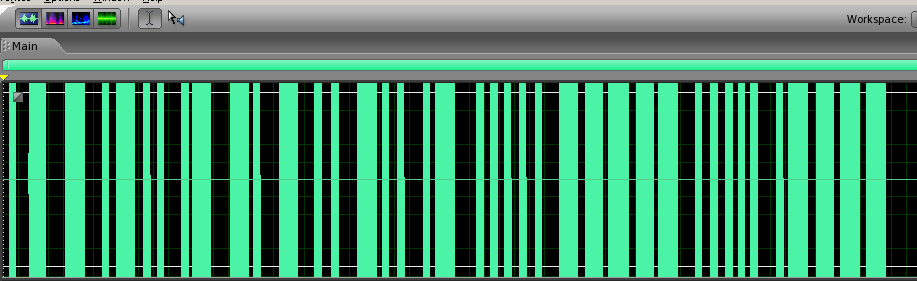

#   Пара-пара-пар!

> It's a russian ctf, so description is in russian

Выйдя наружу, мы оказались окутаны клубами густого пара. Вдыхая его, я почувствовал, что у меня появилось желание воспарить над землей, и я уже ни о чем не парился.  Наверное, в состав пара входили паранормальные вещества, потому что аппаратура показывала параметрическую активность, но нам все это было уже параллельно. Наш паровой транспорт покачивался как пароход, а команда со спартанским спокойствием доедала пармезан. 

«Пар!» - закричал кто-то.  И действительно, от здания напротив, по форме напоминавшего параллелограмм, поднимались клубы пористого пара. Припарковав наш вездеход, мы отправились изучать источник пара. Но добравшись до места, наша уверенность испарилась. На земле лежала только пара странных потрескивающих предметов с таинственным символом: 

 

но позже мой напарник нашёл странный накопитель информации. Было очень запарно, но за пару часов мы все-же распарсили его [содержимое](./2.txt)! 

*Флаг - sha1 от строки в lowercase* 

# Solve:

Let's examine the file:

```Bash
file 2.txt 
``` 

> 2.txt: BTSnoop version 1, HCI UART (H4) 

Well, this is bluetooth log, let's open it with wireshark. 

 

We can see a lot of frames, among them are a lot of 603-byte SBC frames, marked as "Audio sink". I assume that they are exactly what we need, but let's find out what is SBC. 

According to [wikipedia](https://en.wikipedia.org/wiki/SBC_(codec)), SBC is an audio codec for audio transfer over bluetooth. 

So, basically we see an audio stream transmission. 
Now we need to: 
* Extract audio file from HCI log 
* Somehow analyze the file 

I started with second target, tried to find a program that can convert SBC to one of popular audio formats. Long story short, i found that BlueZ includes commands "sbcenc, sbcdec, sbcinfo" that can convert SBC to AU. 

Now we need to extract audio. To make it easier i applied "sbc" as wireshark filter and saved remaining packets as [sbconly.pcap](./sbconly.pcap) 

I did not found any tools to extract SBC from pcap, so i wrote a script on python. 

Before actually writing it, i opened sbconly.pcap in 010editor and compared bytes with wireshark output to determine where is data actually stored. [This is](./sbcinfo.txt) what i end up with:

```
Frame header:
size:0x15
pkt qty place: 0x15

Packet header:
size:0x4

Packet:
size:0x4e

Each SBC frame contains multiple audio packets 
Frame structure:
0x0-0x15 - headers
0x16-0x19 - headers1
0x1A-0x68 - data1
0x69-0x6C - headers2
0x6D-0xbb - data2
0xbc-0xbf - headers3
0xc0-0x10e - data3
...

pcap structure:
0x2b
frame
0x13
frame
0x13
...
``` 

And this is my Python [script](./parsesbcpcap.py):
```Python
#!/usr/bin/env python3
filesize=0x6d8c9+1 # size of sbconly.pcap
pcapInitSpacing=0x2b+1 # to skip pcap headers
pcapDataSpacing=0x13+1 # to skip frame headers in pcap
frameHeader=0x15 
packetHeader=0x4
packetSize=0x4e+1
f=open('sbconly.pcap','rb')
o=open('flag.sbc','wb')

ptr=pcapInitSpacing
while ptr<filesize:
	ptr+=frameHeader
	f.seek(ptr)
	cnt=int.from_bytes(f.read(1),'big')
	ptr+=1
#	print(hex(cnt)+'at'+hex(ptr)+'\n')
	f.seek(ptr)	
	o.write(f.read((packetSize+packetHeader)*cnt))
	ptr+=(packetSize+packetHeader)*cnt+pcapDataSpacing
f.close()
o.close()
``` 

After running it we have [flag.sbc](./flag.sbc) file, to decode it run: 
```Bash
sbcdec -f flag.au flag.sbc
``` 

I tried to open it with VLC, but heared oly BEEP BOOP BEEP (Morse code). So, it's time to open it with an audio editor so be able to see it (I use Audition). 

 

Now we can decode it: 
> atlantida
And get SHA1 of it: 
```Bash
echo atlantida | sha1sum
``` 
> f81f986ab28ae0b299c836597b43aa6577fd75b2